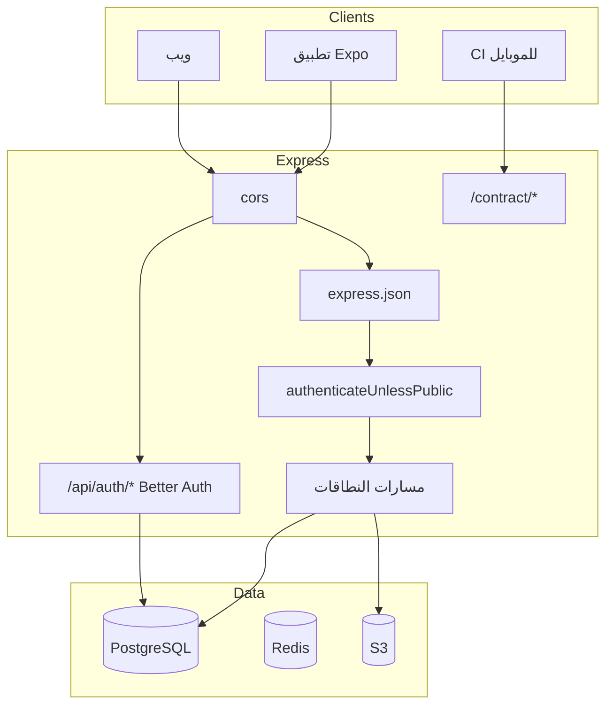

نظرة عامة على بنية **SawaApp** — للتفاصيل الكاملة بالإنجليزية راجع [System architecture](/en/explanation/system-architecture).

## مخطط النظام

## التقنيات

| الطبقة | التقنية |
|--------|---------|
| الخادم | Node.js + Express + TypeScript |
| المصادقة | Better Auth |
| قاعدة البيانات | Drizzle ORM + PostgreSQL |
| التخزين | S3 / MinIO |
| التوثيق | OpenAPI + Scalar + Mintlify |

## البيئات

| البيئة | الرابط |
|--------|--------|
| محلي | `http://localhost:8080` |
| تجريبي | `https://sawa-app-dev.up.railway.app` |
| إنتاج | `https://sawa-app-de848.ondigitalocean.app` |

<CardGroup cols={2}>
  <Card title="English architecture" href="/en/explanation/system-architecture">Full documentation</Card>
  <Card title="المصادقة" href="/en/explanation/auth-architecture">Auth architecture</Card>
</CardGroup>
