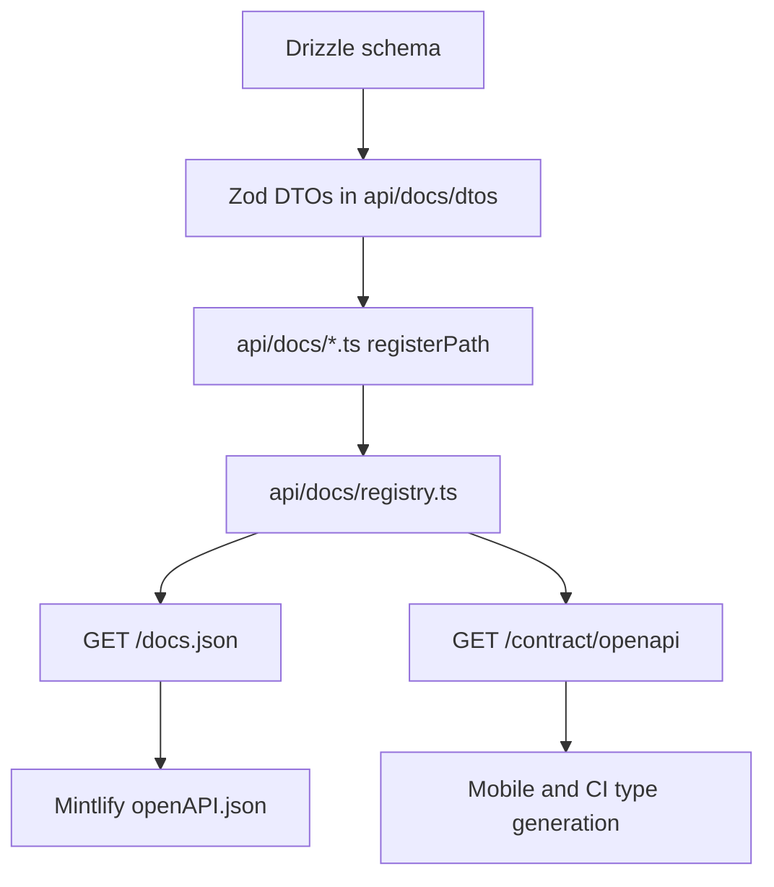

Sawa's API reference is generated from backend code. Do not duplicate endpoint reference by hand unless a generated route is missing.

## DTO and route doc layers

| Folder | Defines | In OpenAPI |
| --- | --- | --- |
| `api/docs/dtos/` | Request/response **shapes** (`PlaceDto`, wrappers) | `components.schemas` |
| `api/docs/*.ts` | HTTP **operations** via `registerPath` | `paths` |

Route doc files import DTOs and attach them to each operation. `registry.ts` auto-loads every `api/docs/*.ts` file (not `dtos/` directly).

## Two OpenAPI surfaces

- `/docs.json` is public and powers Scalar locally.
- `/contract/openapi` is for mobile and CI. It requires `X-Sawa-Contract-Key` and wraps the spec with version and hash metadata.

## Developer rule

When a route changes, update runtime code, DTOs, `registerPath`, generated OpenAPI, and the Mintlify `openAPI.json` copy together.
