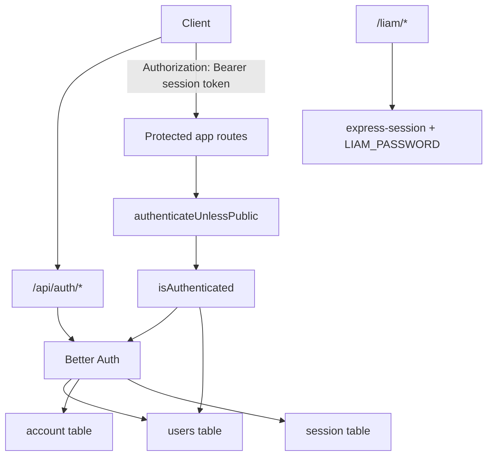

Better Auth owns `/api/auth/*`, and app routes use Better Auth sessions for authorization. Sawa used to roll its own JWT auth, but current development should treat Better Auth as the source of truth.

## Current endpoints

- Sign up: `POST /api/auth/sign-up/email`.
- Sign in: `POST /api/auth/sign-in/email`.
- Sign out: `POST /api/auth/sign-out`.
- Protected app routes: use `Authorization: Bearer <sessionToken>`.

## Public route allowlist

`authenticateUnlessPublic` skips auth for:

- Exact: `/health`, `/docs.json`, `/docs`, `/docs-new`.
- Prefix: `/api/auth/`, `/test/`, `/pets/`, `/liam`.

All other app routes require a valid Better Auth session.

<Note>
  Liam ERD is separate from Better Auth. It uses `express-session`, `LIAM_SESSION_SECRET`, and `LIAM_PASSWORD`.
</Note>

## Legacy auth (do not use)

JWT access tokens, Redis refresh rotation, `/auth/local/*`, and `JWT_SECRET` are obsolete. See [Better Auth migration](/en/concepts/decisions/better-auth-migration) for the endpoint mapping table.
