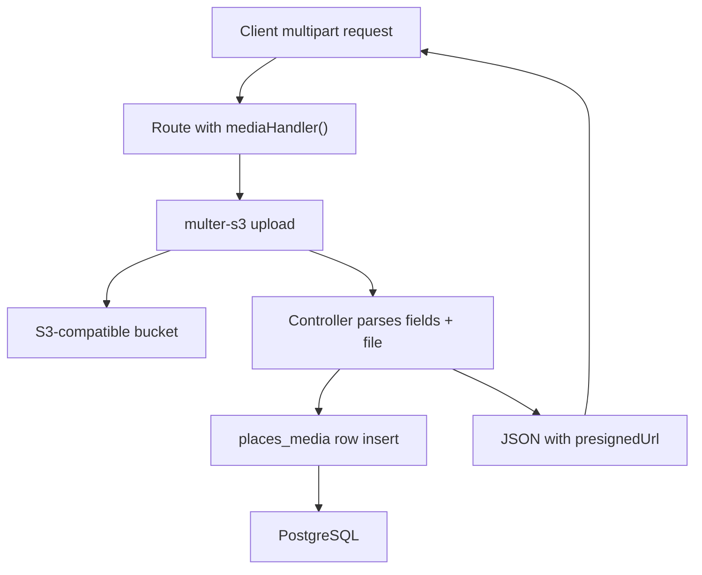

Place and review media uploads use route-level `mediaHandler` middleware backed by `multer-s3`. Metadata is stored in PostgreSQL; clients receive presigned URLs in API responses.

## Key files

| Layer | Path |
| --- | --- |
| Upload middleware | `SawaApp/api/middlewares/mediaHandler.middleware.ts` |
| Storage helpers | `SawaApp/api/utils/mediaHandler.utils.ts` |
| Schema | `SawaApp/api/db/schema/placesMedia.ts` |
| OpenAPI DTOs | `SawaApp/api/docs/dtos/placesMedia.ts` |
| Nested routes | `SawaApp/api/routes/placesMedia.routes.ts` |

## Validation rules

- Images only (`mimetype` starts with `image/`).
- Maximum file size: 5 MB per file (see `zFileSchema` in `api/utils/validation.ts`).

## Response shape

List and detail responses expose `PlaceMediaDto` with a `presignedUrl` field so clients can fetch the object without public bucket ACLs.

## Related guides

- [Manage media uploads](/en/how-to/manage-media-uploads) — step-by-step upload workflow.
- [API Reference](/api-reference) — `Places Media` tag for endpoint details.
