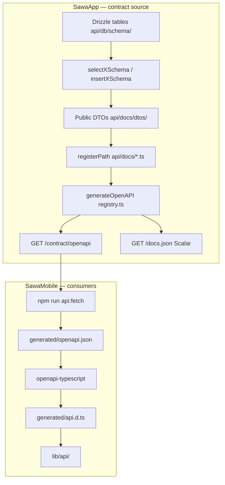
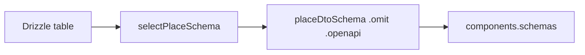

SawaApp defines public API shapes as **OpenAPI 3.0**, generated at runtime from Zod schemas derived from Drizzle tables. Mobile and CI consume a filtered contract from `/contract/openapi` without sharing a monorepo or npm package.

## End-to-end pipeline



## Two backend layers

| Folder | Defines | In OpenAPI |
|--------|---------|------------|
| `api/docs/dtos/` | Field shapes (`PlaceDto`, wrappers) | `components.schemas` |
| `api/docs/*.ts` | Routes (`registerPath`) | `paths` |

Route files import DTOs and attach them to each operation. `registry.ts` auto-loads every `api/docs/*.ts` file.

<Note>
  Express handlers in `api/routes/` are runtime only. Mobile sees a path only if it is also registered via `registerPath` in `api/docs/`.
</Note>

## DTO derivation



Public DTOs use `.omit()` / `.extend()` on drizzle-zod schemas — field lists are not duplicated on mobile.

## Two HTTP surfaces

| Endpoint | Auth | Consumer |
|----------|------|----------|
| `/docs.json` + `/docs` | Public | Scalar browser UI, Mintlify export |
| `/contract/openapi` | `X-Sawa-Contract-Key` | Mobile CI, `npm run api:fetch` |

`/contract/*` mounts **before** session middleware in `server.ts`.

## Export to Mintlify

```bash
cd SawaApp
npm run docs:export:mintlify
```

Writes `MintlifyDocs/openAPI.json` for the API Reference tab.

## Related

<CardGroup cols={2}>
  <Card title="Add OpenAPI docs" icon="file-code" href="/en/how-to/add-openapi-docs">
    How to register new paths.
  </Card>
  <Card title="Contract API for mobile" icon="mobile" href="/en/how-to/contract-api-for-mobile">
    Contract key and version workflow.
  </Card>
  <Card title="Mobile docs" icon="mobile" href="/en/mobile/api-contract">
    Full mobile contract guide.
  </Card>
</CardGroup>
