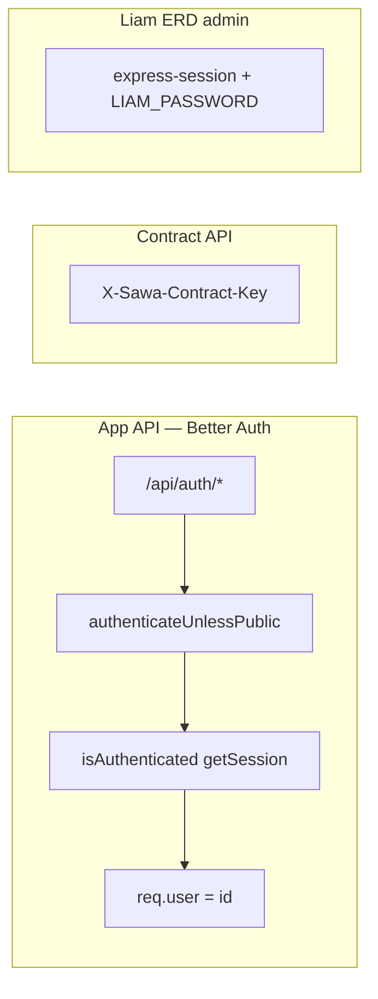
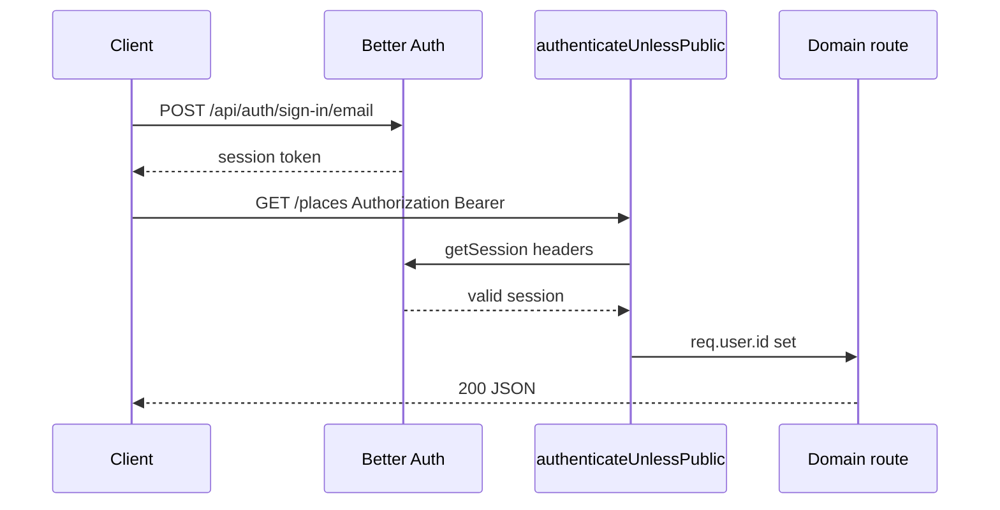

Sawa uses **[Better Auth](https://www.better-auth.com/)** for all user authentication. Better Auth owns `/api/auth/*` routes. Protected business routes verify sessions via `getSession()` and attach `req.user`.

**Liam ERD admin** (`/liam/*`) uses a separate `express-session` + password — not Better Auth.

## Auth trust boundaries



## Old vs new (migration reference)

| Concern | Before (legacy) | After (current) |
|---------|-----------------|-----------------|
| Sign up | `POST /auth/local/signup` | `POST /api/auth/sign-up/email` |
| Sign in | `POST /auth/local/login` | `POST /api/auth/sign-in/email` |
| Auth header | `Bearer <accessToken>` JWT | `Bearer <sessionToken>` |
| Refresh | `POST /auth/refreshToken` + Redis | Better Auth session lifecycle |
| Sign out | `POST /auth/signout` | `POST /api/auth/sign-out` |
| Passwords | `users.password_hash` | `account.password` |
| Secrets | `JWT_SECRET` | `BETTER_AUTH_SECRET`, `BETTER_AUTH_URL` |

## Session flow



## Middleware order (critical)

```ts
app.use(cors({ origin: config.clientUrls, credentials: true }));
app.all("/api/auth/*", toNodeHandler(auth));  // BEFORE express.json()
app.use(express.json());
app.use("/contract", contractRoutes);
app.use(authenticateUnlessPublic);
// ... domain routes
```

<Warning>
  Mounting `express.json()` **before** the Better Auth handler causes auth requests to hang.
</Warning>

## Public routes

Exact paths and prefixes allowed without authentication:

| Type | Paths |
|------|-------|
| Exact | `/health`, `/docs`, `/docs.json`, `/docs-new` |
| Prefix | `/api/auth/`, `/test/`, `/pets/`, `/liam` |

## Plugins and providers

| Config | Purpose |
|--------|---------|
| `emailAndPassword` | Email/password sign-up and sign-in |
| `socialProviders.google` | Google OAuth |
| `plugins: [expo(), bearer(), oneTap()]` | Mobile, Bearer header, Google One Tap |
| `trustedOrigins` | Web + Expo deep links (`exp://`, `sawamobile://`) |

## Database design

**Option A:** Single `users` table for identity + Sawa profile. Passwords and OAuth tokens live in `account`. Sessions in `session`. Verification tokens in `verification`.

## Verification

```bash
node scripts/e2e-auth-smoke.mjs
```

See [Auth endpoints](/en/reference/auth-endpoints) and [Debug auth](/en/how-to/debug-auth).
