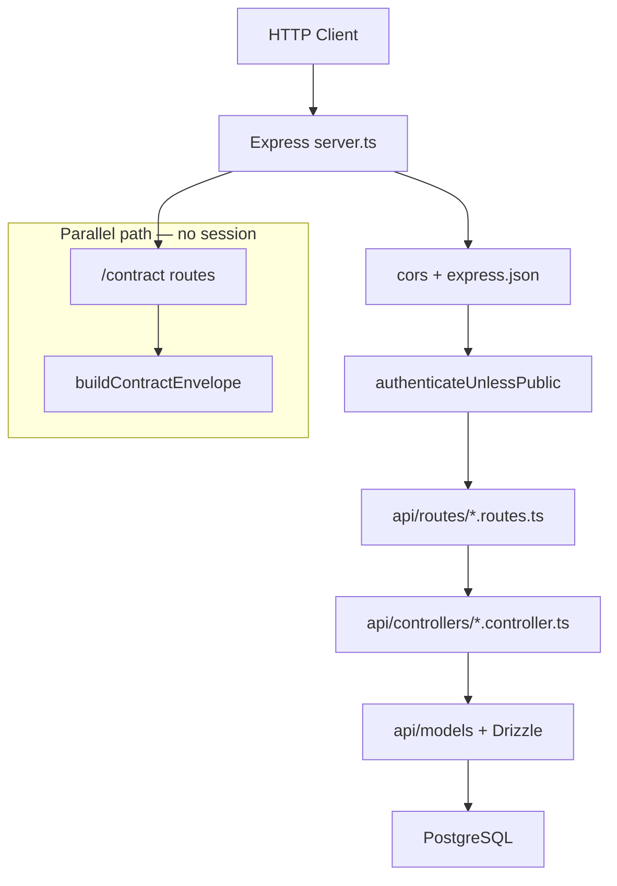

SawaApp follows a layered pattern: **routes → controllers → models → Drizzle → PostgreSQL**. OpenAPI documentation is registered separately in `api/docs/` but mirrors the same domain boundaries.

## Layer diagram

## Layer responsibilities

| Layer | Location | Responsibility |
|-------|----------|----------------|
| **Routes** | `api/routes/` | URL mapping, HTTP verbs, middleware attachment |
| **Controllers** | `api/controllers/` | Parse request, call models, shape HTTP responses |
| **Models** | `api/models/` | Queries, business rules, Drizzle operations |
| **Schema** | `api/db/schema/` | Table definitions, Zod insert/select schemas |
| **Docs** | `api/docs/` | OpenAPI `registerPath` + public DTOs |

## Standard request lifecycle

1. Request hits Express with CORS headers applied
2. Better Auth handles `/api/auth/*` before JSON parsing
3. `express.json()` parses body
4. `/contract/*` served with API-key auth (no user session)
5. `authenticateUnlessPublic` checks bearer session (or allows public paths)
6. Domain router dispatches to controller
7. Controller calls model; model queries PostgreSQL
8. Response returned as JSON with standard error wrapper on failure

## Error handling

Errors flow through centralized middleware:

- Controllers throw `createCommonError(...)` → `CustomError`
- `errorHandler` middleware formats consistent JSON error responses
- See [Error codes](/en/reference/error-codes)

## OpenAPI parallel path

Runtime Express handlers and OpenAPI registration are **separate but must stay in sync**:

- Handlers in `api/routes/` execute requests
- `api/docs/*.ts` documents paths for Scalar and mobile contract
- A route without `registerPath` is invisible to mobile codegen

See [API contract architecture](/en/explanation/api-contract-architecture).

## Related

<CardGroup cols={2}>
  <Card title="Server reference" icon="server" href="/en/reference/server">
    Middleware order and public routes.
  </Card>
  <Card title="Add a route" icon="route" href="/en/how-to/add-a-route">
    Step-by-step feature checklist.
  </Card>
</CardGroup>
