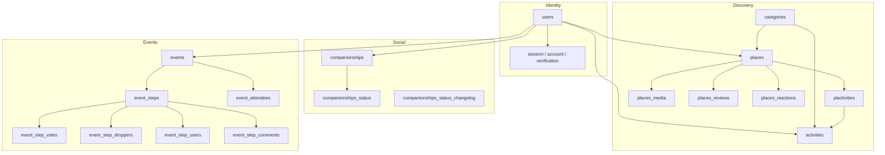

Sawa's PostgreSQL schema is organized around **identity**, **discovery content**, **social graph**, and **collaborative events**.

## Domain map

## Domain summary

| Domain | Primary tables | Purpose |
|--------|----------------|---------|
| Users | `users`, `genders` | Profile + Better Auth identity |
| Auth | `session`, `account`, `verification` | Sessions, credentials, verification |
| Categories | `categories`, `category_types` | Taxonomy |
| Places | `places` | Venues with geo and pricing |
| Activities | `activities` | Things to do |
| Plactivities | `plactivities` | Place ↔ activity links |
| Place media | `places_media`, `media_types` | S3-backed images |
| Reactions | `places_reactions`, `reactions_types` | User reactions to places |
| Reviews | `places_reviews` | Text reviews |
| Companionships | `companionships`, `companionships_status` | Friend requests |
| Events | `events`, `event_steps`, `event_attendees`, votes, comments | Collaborative planning |

## Standard table fields

Most domain tables include:

- `id` — serial primary key
- `isDeleted` — soft delete flag
- `createdAt` / `updatedAt` — epoch timestamps

## Schema location

All Drizzle definitions live in `SawaApp/api/db/schema/`. Migrations in `api/db/migrations/`.

<CardGroup cols={2}>
  <Card title="Database schema" icon="database" href="/en/reference/database/schema">
    Schema patterns and Zod validation.
  </Card>
  <Card title="Tables index" icon="table" href="/en/reference/database/tables">
    Table listing by domain.
  </Card>
  <Card title="Events domain" icon="calendar" href="/en/explanation/events-domain">
    Event lifecycle and workflow.
  </Card>
</CardGroup>
