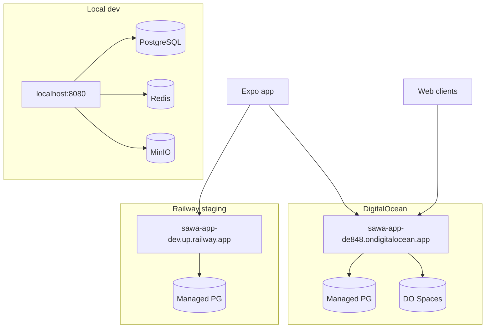

SawaApp runs on **Railway** (staging/dev) and **DigitalOcean App Platform** (production). Local development uses Docker or native PostgreSQL, Redis, and MinIO.

## Environment topology

## Environment URLs

| Environment | API URL | Typical use |
|-------------|---------|-------------|
| Local | `http://localhost:8080` | Development |
| Staging | `https://sawa-app-dev.up.railway.app` | Mobile OAuth, integration testing |
| Production | `https://sawa-app-de848.ondigitalocean.app` | Live users |

## Critical production env vars

| Variable | Required in prod |
|----------|------------------|
| `BETTER_AUTH_SECRET` | Yes (≥32 chars) |
| `BETTER_AUTH_URL` | Yes (public API URL for OAuth callbacks) |
| `DATABASE_URL` | Yes |
| `LIAM_SESSION_SECRET` | Yes (fail-fast if missing) |
| `CONTRACT_API_KEY` | Recommended (503 on `/contract/*` if unset) |
| `CLIENT_URL` | Yes (comma-separated CORS origins) |

## BETTER_AUTH_URL per environment

Set `BETTER_AUTH_URL` to the **public URL clients use** — OAuth callbacks depend on it.

- Local-only: `http://localhost:8080`
- Mobile testing against staging: `https://sawa-app-dev.up.railway.app`

## Docs and API explorers

| Surface | URL pattern |
|---------|-------------|
| Scalar (prod) | `https://sawa-app-de848.ondigitalocean.app/docs` |
| OpenAPI JSON | `/docs.json` on any environment |
| Mintlify docs | Deployed from `Mintlify-Docs` repo |

See [Deploy](/en/how-to/deploy) for deployment checklist.
