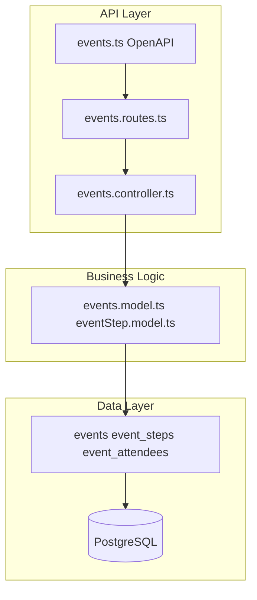
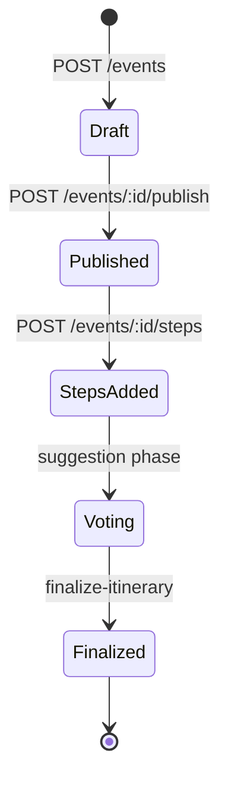

Events are Sawa's richest domain — collaborative trip planning with published itineraries, step voting, attendee RSVP, and workflow phases.

## Component architecture

## Event lifecycle

## Key concepts

| Concept | Description |
|---------|-------------|
| **Event** | Top-level planning container (title, dates, host) |
| **Steps** | Itinerary items — can be nested (parent/child) |
| **Votes** | Attendees vote on step suggestions |
| **Attendees** | RSVP, invite, role management |
| **Phases** | Suggestion → voting → threshold checks → finalize |

## Main API groups

- `GET/POST /events` — list and create
- `POST /events/:id/publish` — publish draft
- `GET/POST /events/:id/steps` — manage itinerary steps
- `POST /events/:id/steps/:stepID/votes` — voting
- `GET/POST /events/:id/attendees` — RSVP and invites
- `POST /events/:id/finalize-itinerary` — close planning

Full endpoint list: **API Reference** tab → Events tag, or [Events reference](/en/reference/domains/events).

## Related

<Card title="Events reference" icon="calendar" href="/en/reference/domains/events">
  Tables, endpoints, and business rules.
</Card>
