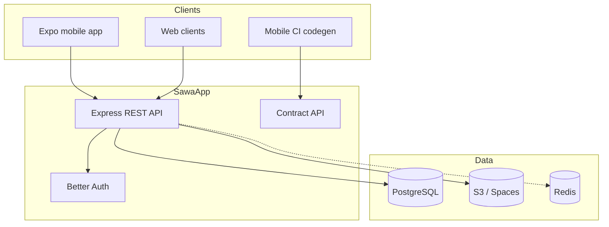

Sawa is a **social activity-planning platform**. People discover venues and things to do, connect with companions, and collaboratively plan outings through events with voting, RSVP, and shared itineraries.

## Core domains

| Domain | What it does |
|--------|--------------|
| **Users** | Profiles, identity (Better Auth), search |
| **Places** | Venues with geo, pricing, categories, media |
| **Activities** | Things to do, linked to categories |
| **Plactivities** | Which activities exist at which place |
| **Companionships** | Friend requests — send, accept, reject |
| **Events** | Collaborative trip planning — steps, votes, attendees, itinerary |

## Platform components

## Documentation map

<CardGroup cols={2}>
  <Card title="System architecture" icon="sitemap" href="/en/explanation/system-architecture">
    Technical stack and deployment.
  </Card>
  <Card title="Data model" icon="database" href="/en/explanation/data-model-overview">
    Tables and relationships.
  </Card>
  <Card title="Events domain" icon="calendar" href="/en/explanation/events-domain">
    Collaborative planning workflow.
  </Card>
  <Card title="Developer onboarding" icon="rocket" href="/en/tutorials/dev-onboarding">
    Get the API running locally.
  </Card>
</CardGroup>
