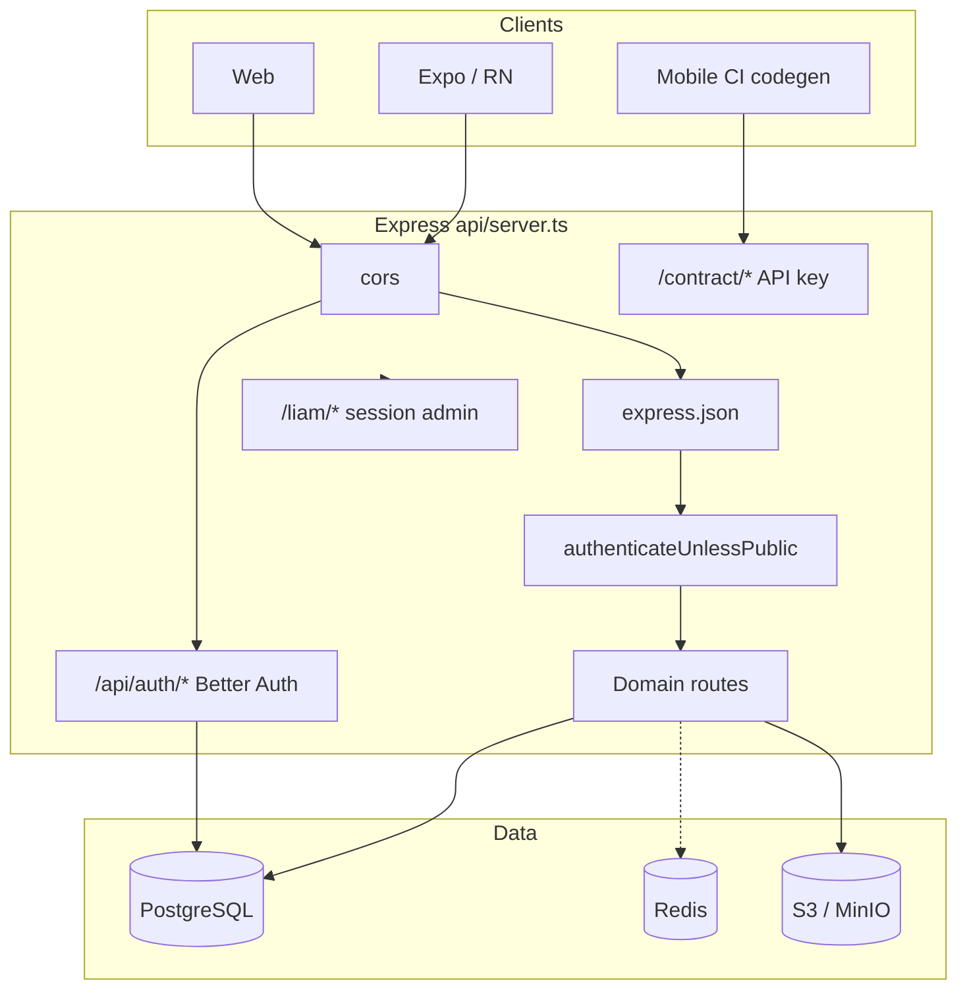

SawaApp is a Node.js / Express / TypeScript REST API backed by PostgreSQL, with Better Auth for identity, S3-compatible storage for media, and Redis connected at startup.

## System context



## Tech stack

| Layer | Technology |
|-------|------------|
| Runtime | Node.js, TypeScript |
| HTTP | Express 4 |
| Auth | Better Auth (`better-auth`, `@better-auth/expo`) |
| ORM | Drizzle ORM + PostgreSQL |
| Cache | Redis (connected; not central to auth) |
| Object storage | AWS SDK v3 → MinIO (dev) / DigitalOcean Spaces (prod) |
| API docs | Zod + `@asteasolutions/zod-to-openapi`, Scalar |
| Email | Resend |

## API layer structure

```
api/
├── server.ts       # Entry point, middleware order
├── config.ts       # Env-driven configuration
├── auth/           # Better Auth instance
├── contract/       # Mobile/CI OpenAPI contract
├── controllers/    # HTTP handlers
├── models/         # Data access (Drizzle)
├── routes/         # Express routers
├── middlewares/    # Auth, validation, media, errors
├── docs/           # OpenAPI route + DTO registration
└── db/             # Schema, migrations, seed
```

## Request flow

```
Client → CORS → Better Auth (if /api/auth/*) → express.json()
       → Contract routes (if /contract/*)
       → authenticateUnlessPublic → Domain routes → Controller → Model → PostgreSQL
```

## Environments

| Environment | URL |
|-------------|-----|
| Local | `http://localhost:8080` |
| Staging | `https://sawa-app-dev.up.railway.app` |
| Production | `https://sawa-app-de848.ondigitalocean.app` |

See [Deployment topology](/en/explanation/deployment-topology) for details.

## Related

<CardGroup cols={2}>
  <Card title="Backend layers" icon="layer-group" href="/en/explanation/backend-layers">
    Routes, controllers, models in depth.
  </Card>
  <Card title="Auth architecture" icon="lock" href="/en/explanation/auth-architecture">
    Better Auth and trust boundaries.
  </Card>
  <Card title="Data model" icon="database" href="/en/explanation/data-model-overview">
    Domain ER diagram.
  </Card>
</CardGroup>
