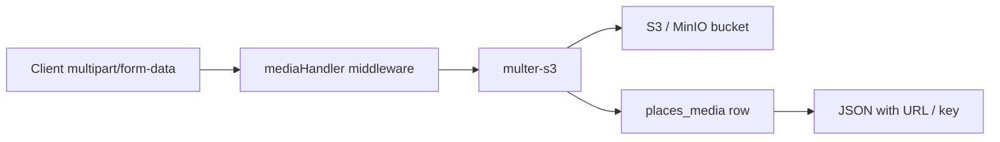

Place images flow through multipart HTTP → Multer → S3-compatible storage.

## Upload flow

## Create place with media

`POST /places` accepts `multipart/form-data` with place fields and image files.

## Add media to existing place

`POST /places/:placeID/media` with file field(s).

## Configuration

S3 credentials from env — see [Configuration](/en/reference/configuration) (`MINIO_*_DEV` or DigitalOcean Spaces vars).

## Presigned URLs

The API may return presigned URLs for clients to display images without public bucket ACLs. Implementation in `api/utils/` and media models.

## OpenAPI

Multipart operations are documented in OpenAPI but may require manual `FormData` on mobile — see [Mobile API contract](/en/mobile/api-contract).
