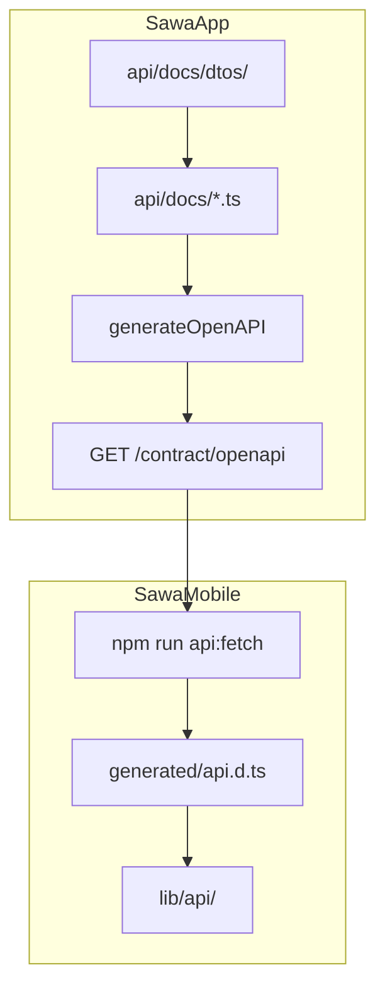

SawaMobile consumes a **filtered OpenAPI document** from SawaApp without importing backend code or duplicating field definitions.

## What was built

1. **Backend** — `api/docs/dtos/` (shapes) + `api/docs/*.ts` (`registerPath` for routes) merge via `registry.ts` into one OpenAPI document.
2. **Mobile** — `openapi-typescript` generates `generated/api.d.ts`. `lib/api/` wraps `fetch` with typed `apiCall`.
3. **Drift checks** — `npm run api:verify` and `tsc` catch breaking API changes at build time.

## Architecture

## Two HTTP surfaces

| Endpoint | Auth | Used by |
|----------|------|---------|
| `/docs.json` | Public | Scalar, Mintlify export |
| `/contract/openapi` | `X-Sawa-Contract-Key` | Mobile CI, `api:fetch` |

## What mobile gets

| Layer | Backend folder | OpenAPI section |
|-------|----------------|-----------------|
| Shapes | `api/docs/dtos/` | `components.schemas` |
| Routes | `api/docs/*.ts` | `paths` |

Both are required: DTOs alone do not add callable paths; routes without `registerPath` are invisible to codegen.

## Environment variables

**SawaApp:** `CONTRACT_API_KEY`, `API_CONTRACT_VERSION`

**SawaMobile:** `SAWA_CONTRACT_API_KEY`, `EXPO_PUBLIC_API_URL` (see `.env.example`)

## Key paths

| Repo | Path |
|------|------|
| Contract builder | `SawaApp/api/contract/buildContract.ts` |
| Fetch script | `SawaMobile/scripts/fetch-openapi.mjs` |
| Generated types | `SawaMobile/generated/api.d.ts` |
| API client | `SawaMobile/lib/api/` |

See [Codegen](/en/mobile/codegen) for npm scripts.
