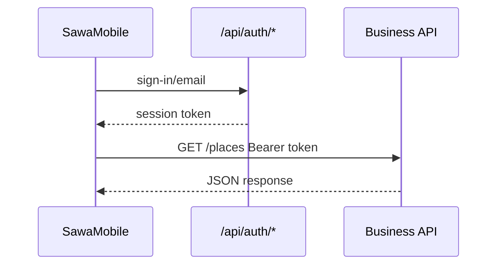

SawaMobile authenticates via **Better Auth** — the same `/api/auth/*` endpoints as web clients, using the `@better-auth/expo` plugin on the server.

## Auth model

| Concern | Implementation |
|---------|----------------|
| Sign up / sign in | `POST /api/auth/sign-up/email`, `POST /api/auth/sign-in/email` |
| Session token | Bearer header on API requests |
| Sign out | `POST /api/auth/sign-out` |
| Google OAuth | Better Auth social provider + Expo deep links |

<Note>
  Use **session tokens** from Better Auth. Legacy JWT endpoints (`/auth/local/*`) were removed.
</Note>

## Runtime flow

## Server configuration

- `BETTER_AUTH_URL` must match the URL the mobile app uses (staging Railway URL for device testing)
- `trustedOrigins` in `auth.config.ts` includes `exp://` and `sawamobile://` schemes
- `expo()` plugin enabled for React Native

## Client implementation

Auth helpers live in `SawaMobile/lib/api/auth.ts` (and session provider in the app). Typed paths come from `generated/api.d.ts` where auth routes are registered.

## Debugging

- [Debug auth](/en/how-to/debug-auth) on the backend
- [Auth endpoints](/en/reference/auth-endpoints) reference
- [Auth architecture](/en/explanation/auth-architecture)
