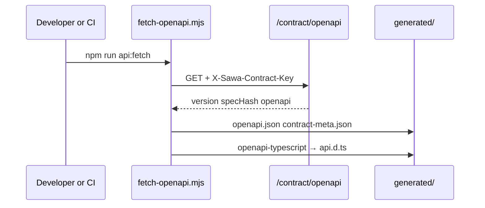

## npm scripts (SawaMobile)

| Script | Action |
|--------|--------|
| `npm run api:fetch` | Download contract from `/contract/openapi` |
| `npm run api:codegen` | Generate types from local snapshot (offline) |
| `npm run api:verify` | Compare `contract-meta.json` vs baseline |
| `npm run typecheck` | TypeScript compile — catches API drift |

## Fetch workflow

## Prerequisites

1. SawaApp running with `CONTRACT_API_KEY` set
2. `SAWA_CONTRACT_API_KEY` in SawaMobile `.env` matching the server key
3. `EXPO_PUBLIC_API_URL` pointing at the API base URL

## After backend API changes

1. Backend: add `registerPath` + DTOs, bump `API_CONTRACT_VERSION` if breaking
2. Deploy or run SawaApp locally
3. Mobile: `npm run api:fetch`
4. Fix any `tsc` errors from changed types
5. Update `lib/api/*Methods` if new routes need client wrappers

## Offline codegen

`npm run api:codegen` uses the existing `generated/openapi.json` snapshot — useful without a running server.

## Related

<CardGroup cols={2}>
  <Card title="API contract" href="/en/mobile/api-contract">Architecture</Card>
  <Card title="Add OpenAPI docs" href="/en/how-to/add-openapi-docs">Backend registration</Card>
</CardGroup>
