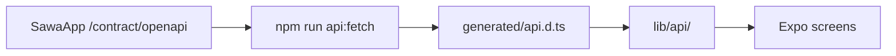

Documentation for the **SawaMobile** Expo / React Native app and how it integrates with SawaApp.

## Overview

SawaMobile does not share a monorepo with SawaApp. Instead, it syncs an **OpenAPI contract** at build time and generates TypeScript types.

## Guides

<CardGroup cols={2}>
  <Card title="API contract" icon="file-contract" href="/en/mobile/api-contract">
    How the OpenAPI contract works between repos.
  </Card>
  <Card title="Mobile auth" icon="lock" href="/en/mobile/auth">
    Better Auth bearer sessions on Expo.
  </Card>
  <Card title="Codegen" icon="code" href="/en/mobile/codegen">
    Fetch, verify, and regenerate types.
  </Card>
  <Card title="Backend contract API" icon="server" href="/en/how-to/contract-api-for-mobile">
    Server-side contract endpoints.
  </Card>
</CardGroup>

## Backend reference

<Card title="API contract architecture" icon="diagram-project" href="/en/explanation/api-contract-architecture">
  DTOs, registerPath, and the full pipeline diagram.
</Card>
