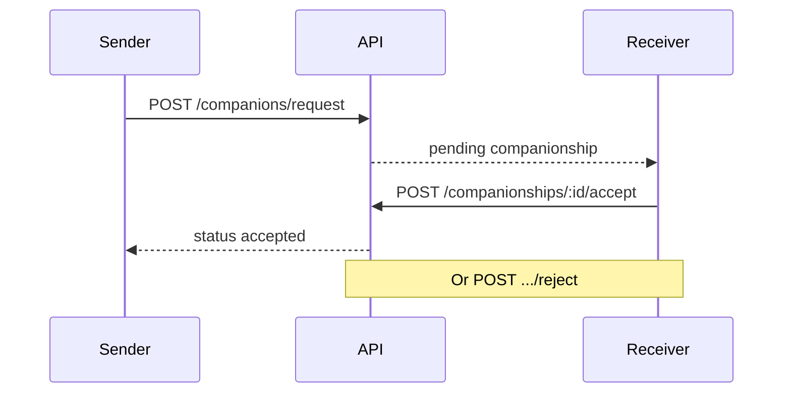

Companionships model the social graph: users send companion requests that receivers can accept or reject.

## Flow

## Tables

| Table | Purpose |
|-------|---------|
| `companionships` | Request records (`senderID`, `receiverID`, `statusID`) |
| `companionships_status` | Status lookup |
| `companionships_status_changelog` | History of status changes |

## API endpoints

| Method | Path | Description |
|--------|------|-------------|
| GET | `/companions/potential` | Suggested companions |
| POST | `/companions/request` | Send request |
| GET | `/companionships/sent` | Outgoing requests |
| GET | `/companionships/received` | Incoming requests |
| POST | `/companionships/:id/accept` | Accept |
| POST | `/companionships/:id/reject` | Reject |
| GET | `/companionships/:userID` | Companions for user |

OpenAPI: **API Reference** tab → Companionships tag.
