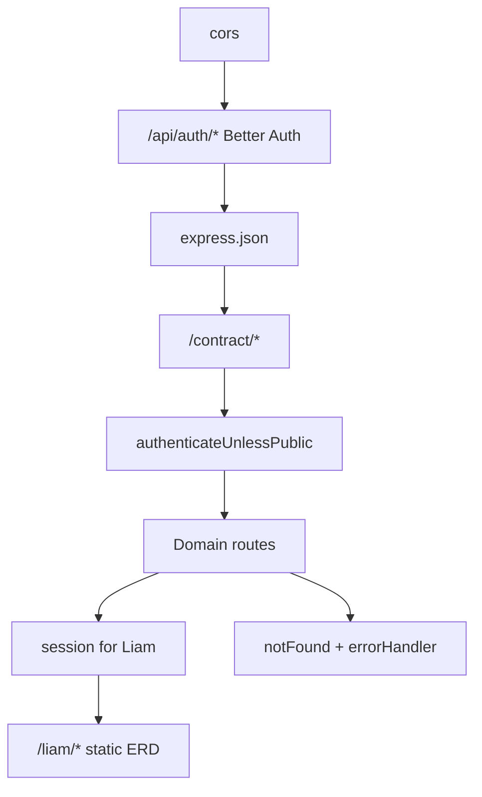

The entry point is `api/server.ts`. Middleware order is **critical** — especially Better Auth before `express.json()`.

## Middleware order

## Route mounts

| Prefix | Auth | Description |
|--------|------|-------------|
| `/api/auth/*` | Public | Better Auth (sign-up, sign-in, OAuth, session) |
| `/contract/*` | `X-Sawa-Contract-Key` | Mobile/CI OpenAPI contract |
| `/health` | Public | Health check |
| `/docs`, `/docs-new`, `/docs.json` | Public | Scalar + OpenAPI spec |
| `/pets/*`, `/test/*` | Public | Demo/test routes |
| `/liam/*` | Session + password | DB ERD admin |
| `/users`, `/places`, `/events`, … | Bearer session | Business API |

## Protected route pattern

Global gate `authenticateUnlessPublic` runs before all business routes. Individual routes do not need per-route auth middleware unless extra checks are required.

Authenticated requests set `req.user = { id: number }` after `getSession()` and loading the `users` row.

## Public allowlist

Implemented in `authenticateUnlessPublic.middleware.ts`:

**Exact paths:** `/health`, `/docs`, `/docs.json`, `/docs-new`

**Prefixes:** `/api/auth/`, `/test/`, `/pets/`, `/liam`

## Production guards

- `BETTER_AUTH_SECRET` validated at boot via `assertAuthEnv()`
- `LIAM_SESSION_SECRET` required in production
- Warns if `CONTRACT_API_KEY` unset in production

## Port binding

Server binds `0.0.0.0` and auto-increments port on `EADDRINUSE`. Logs LAN IPs for mobile device testing on same WiFi.
