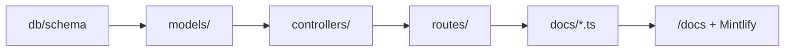

This tutorial adds a minimal read-only feature following SawaApp conventions: **schema → model → controller → route → OpenAPI docs**.

We use the existing patterns — you will extend a domain rather than invent a new stack.

## Overview



## Steps

<Steps>
  <Step title="Define or extend the Drizzle schema">
    Add or update a table in `api/db/schema/`. Follow the standard pattern: `id`, `isDeleted`, `createdAt`, `updatedAt`, plus domain fields.

    Run migrations:

    ```bash
    npm run db:push
    ```
  </Step>

  <Step title="Create the model">
    In `api/models/`, add query functions using Drizzle. Models contain data access and business queries — no HTTP logic.
  </Step>

  <Step title="Create the controller">
    In `api/controllers/`, handle `req`/`res`, call the model, and return responses via `createCommonError` on failure.
  </Step>

  <Step title="Wire the route">
    In `api/routes/`, define Express routes and mount them in `api/server.ts` **after** `authenticateUnlessPublic` unless the route is public.
  </Step>

  <Step title="Register OpenAPI">
    Create or update `api/docs/<domain>.ts`:

    - Import DTOs from `api/docs/dtos/`
    - Call `docsRegistry.registerPath({ path, method, request, responses })`

    The file is auto-loaded by `api/docs/registry.ts`.
  </Step>

  <Step title="Export and verify">
    ```bash
    npm run docs:export:mintlify
    npm run dev
    ```

    Check Scalar at `/docs` and the Mintlify API Reference tab.
  </Step>
</Steps>

## Deeper guides

<CardGroup cols={2}>
  <Card title="Add a route" icon="route" href="/en/how-to/add-a-route">
    Detailed checklist for each layer.
  </Card>
  <Card title="Add OpenAPI docs" icon="file-code" href="/en/how-to/add-openapi-docs">
    DTOs, registerPath, and mobile contract flags.
  </Card>
  <Card title="API contract architecture" icon="diagram-project" href="/en/explanation/api-contract-architecture">
    How DTOs flow to mobile codegen.
  </Card>
</CardGroup>
